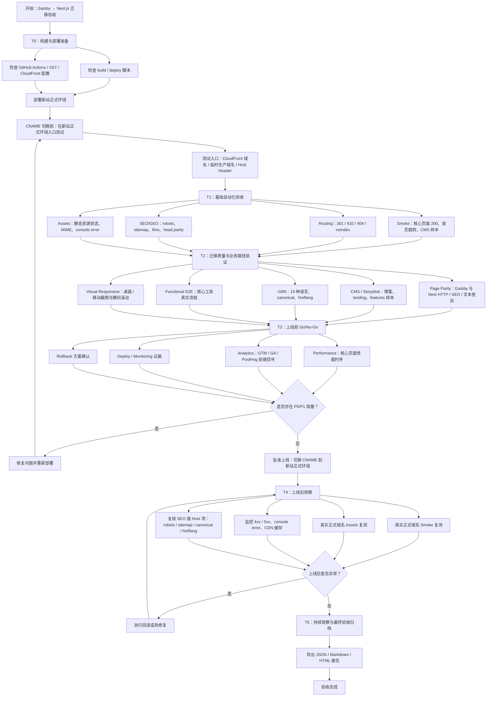

# 迁移测试验收方案

## 结论

你的理解是对的：迁移验收的主测试应在**新站正式环境已经部署完成**之后执行，但此时**还不要把线上 CNAME 切到新站**。

这个阶段建议使用 CloudFront distribution 域名、临时生产域名，或带 Host Header 的生产入口访问新站，验证真实生产基础设施上的行为。只有 Go/No-Go 通过后，才切换 CNAME。切换完成后还需要再跑一轮上线后观察，确认真实用户入口、DNS、CDN 缓存和线上监控都正常。

需要注意：如果测试入口不是最终正式域名，canonical、hreflang、robots、sitemap、Cookie Domain 等强依赖 Host 的检查可能会与最终线上表现不同。这类项目要么通过 Host Header 模拟最终域名，要么在 CNAME 切换后作为 T4 上线后验证重点复测。

## 测试步骤流程图

## 阶段说明

| 阶段 | 时机 | 目标 |
| --- | --- | --- |
| T0 构建与部署准备 | 部署正式环境前 | 确认代码、部署脚本、基础设施和回滚路径准备好 |
| T1 基础自动化验收 | 正式环境已部署，CNAME 未切换 | 验证新站正式环境的基础页面、路由、SEO 产物和静态资源 |
| T2 迁移质量与业务路径验证 | CNAME 未切换 | 对比 Gatsby 与 Next 的页面差异，覆盖 CMS、多语言、E2E、响应式 |
| T3 Go/No-Go | CNAME 切换前 | 汇总性能、埋点、监控、回滚证据，判断是否允许切换 |
| T4 上线后观察 | CNAME 已切换 | 用真实正式域名复测关键项，观察 DNS、CDN、监控和 SEO Host 相关行为 |
| T5 最终归档 | 稳定观察后 | 导出报告，沉淀缺陷、豁免项、结论和后续跟踪 |

## 推荐执行口径

- CNAME 切换前的自动化验收使用 `env=production`，目标 URL 指向新站正式环境入口。
- 如果目标 URL 不是最终正式域名，SEO Host 强相关项需要标记为“预检结果”，并在 T4 用真实正式域名复测。
- Go/No-Go 的硬门槛是没有 P0/P1 阻塞；P2/P3 可以记录为观察项或上线后修复项。
- 切 CNAME 不是测试开始点，而是 Go/No-Go 通过后的发布动作；切换后仍必须做上线后观察。
